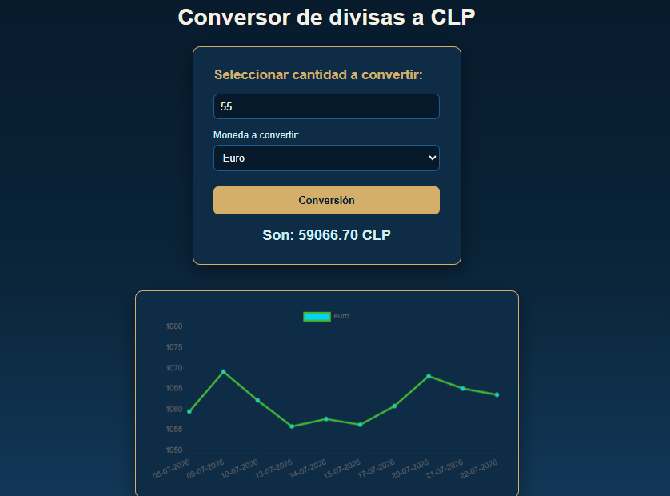

# Conversor divisas a clp

Aplicacion web simple para convertir montos a Peso Chileno (CLP) usando valores de divisas en tiempo real. Permite ingresar un monto, seleccionar una divisa (Euro, Dolar, UF, Libra de Cobre), obtener la conversion y visualizar el historial de los ultimos 10 dias en un grafico de linea.

## Demo

[Ver proyecto en GitHub Pages](https://camlo77.github.io/Conversor-divisas/)

## Captura de pantalla

## Funcionalidades

- Ingresar un monto y seleccionar una divisa desde un select
- Conversion del monto a CLP usando la API de mindicador.cl
- Visualizacion del resultado de la conversion
- Grafico de linea con el historial de los ultimos 10 dias de la divisa seleccionada
- Actualizacion del grafico al cambiar de divisa y convertir nuevamente

## Tecnologias utilizadas

- HTML5
- CSS3 (Flexbox)
- JavaScript (JS, DOM manipulation, Fetch API, async/await)
- Chart.js
- API de mindicador.cl